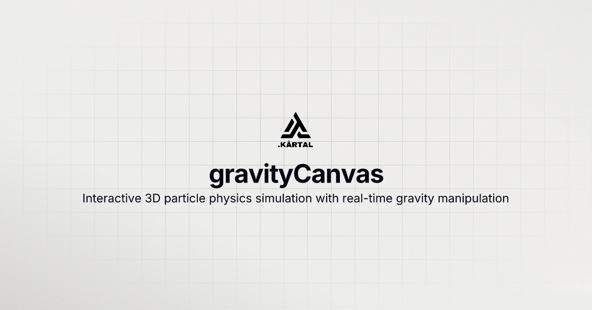

# gravityCanvas



[](https://opensource.org/licenses/MIT)
[](https://www.typescriptlang.org/)
[](https://vitejs.dev/)
[](https://nodejs.org/)
[](https://github.com/MuhammedKartal/Gravity#using-docker)

## Interactive 3D particle physics simulation with real-time gravity manipulation

[Overview](#overview) • [Quick Start](#quick-start) • [Controls](#controls) • [Development](#development) • [License](#license)

## Overview

Gravity Canvas is a blazing-fast implementation of interactive 3D particle physics simulation designed for real-time visualization. It combines the power of 3D perspective projection with smooth 60+ FPS rendering, making it suitable for both educational and entertainment purposes.


## Quick Start

### Installation

```bash
# Clone repository
git clone https://github.com/MuhammedKartal/Gravity.git
cd Gravity

# Install dependencies
npm install
```

### Basic Usage

```bash
# Start development server
npm run dev

# Open browser to http://localhost:5173
```

## Controls

| Action | Effect |
|--------|--------|
| **Left Click** | Create attractive gravity well |
| **Right Click** | Create repulsive gravity well |
| **Space** | Pause/Resume simulation |
| **Clear** | Remove all gravity wells |
| **Trails** | Toggle particle trails on/off |

## Project Structure

### Project Directory Structure

```text
Gravity/
├── package.json              # Main package configuration
├── README.md                 # Project README
├── LICENSE                   # MIT License
├── src/                      # Frontend source code
│   ├── main.ts               # Application entry point
│   ├── index.html            # Main HTML file
│   ├── styles.css            # Application styles
│   ├── types.ts              # TypeScript type definitions
│   ├── core/                 # Core simulation logic
│   │   ├── Particle3D.ts     # 3D particle implementation
│   │   ├── GravityWell.ts    # Gravity well physics
│   │   └── SimulationEngine.ts # Main simulation engine
│   ├── ui/                   # User interface
│   │   └── UIController.ts   # UI state management
│   └── utils/                # Utility functions
│       ├── math.ts           # 2D math utilities
│       ├── math3D.ts         # 3D math utilities
│       └── validation.ts     # Input validation
├── backend/                  # Backend services
│   ├── src/                  # Backend source code
│   │   ├── index.ts          # Server entry point
│   │   ├── config/           # Configuration files
│   │   ├── controllers/      # API controllers
│   │   ├── services/         # Business logic
│   │   ├── middleware/       # Express middleware
│   │   └── routes/           # API routes
│   ├── tests/                # Backend tests
│   └── Dockerfile            # Backend container
├── aws-infrastructure/       # AWS deployment
│   ├── lib/                  # CDK stack definitions
│   └── bin/                  # CDK app entry point
├── tests/                    # Frontend tests
│   ├── core/                 # Core logic tests
│   └── utils/                # Utility tests
├── scripts/                  # Deployment scripts
├── docker-compose.yml        # Docker Compose configuration
├── Dockerfile               # Main Docker configuration
├── nginx.conf               # Nginx configuration
├── vite.config.ts           # Vite configuration
├── tsconfig.json            # TypeScript configuration
└── vitest.config.ts         # Test configuration
```

## Development

### Frontend Development

```bash
# Start development server
npm run dev

# Build for production
npm run build

# Run tests
npm run test

# Lint code
npm run lint
```

### Backend Development

```bash
# Start backend server
cd backend
npm run dev

# Run backend tests
npm run test
```

### Full Stack with Docker

```bash
# Start all services
docker-compose up

# Development with hot reload
docker-compose up -d
```


## License

This project is licensed under the MIT License - see the LICENSE file for details.

## Gravity Canvas - Interactive 3D Particle Physics Simulation

[GitHub](https://github.com/MuhammedKartal/Gravity) • [Developer Website](https://kartal.dev)

---

**Developed by Muhammed Kartal | [kartal.dev](https://kartal.dev)**
